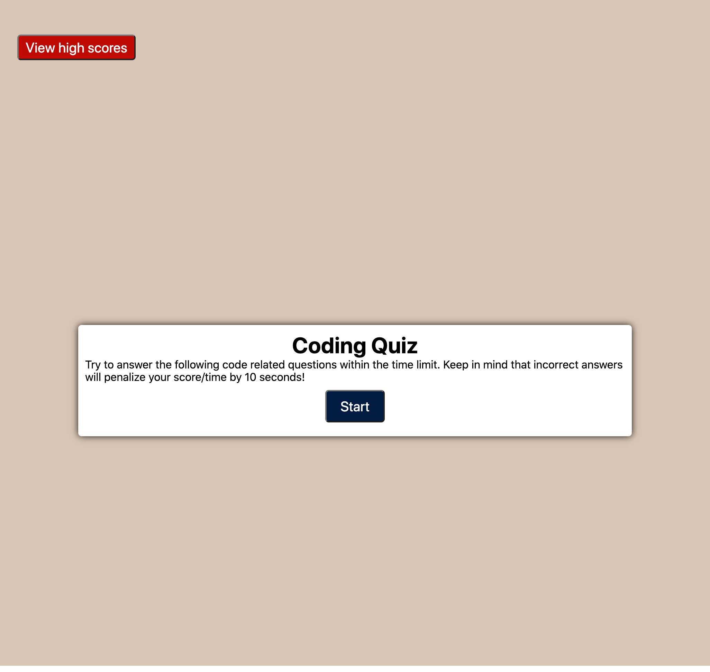

# code-quiz

The following is a coding quiz that tests the user on coding knowledge. 

The application features the following:
* Start screen
* Quiz questions with buttons that allow the user to select an answer and continue to the next question
* Timer that translates to the user's final score
* End screen to submit and store the user's score
* High score list to show previous scores.

The application also includes error handling for the following:
* No answer selected

## Deployment
[d-belleza.github.io/code-quiz](https://d-belleza.github.io/code-quiz)

